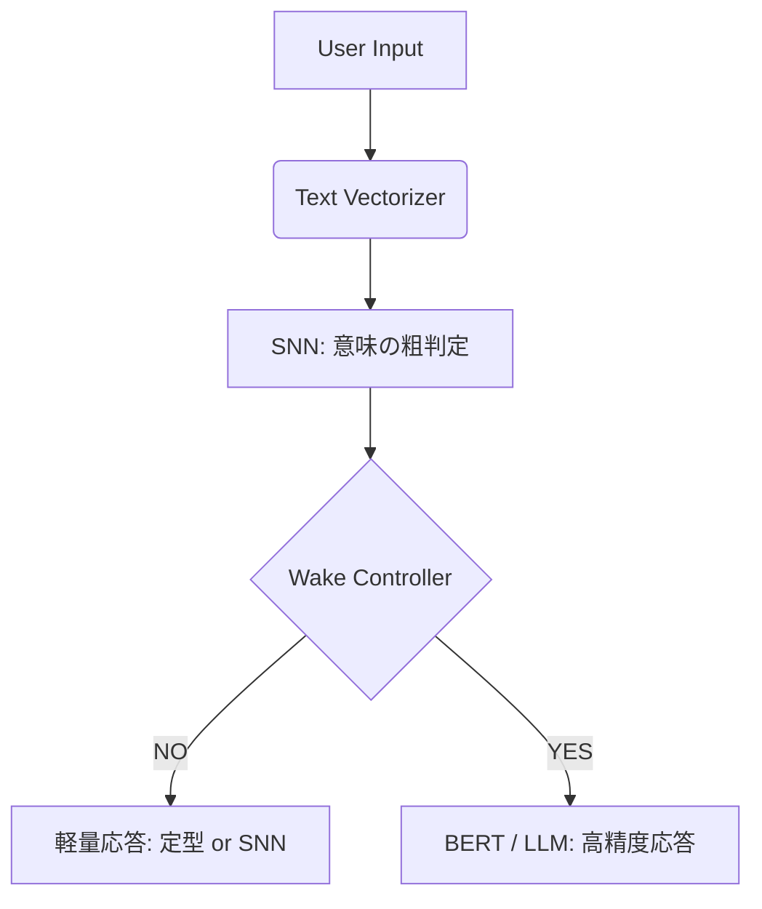

# Wake-on-SNN Chatbot

**Energy-Efficient Hybrid Chatbot with Spiking Neural Network Gating**

---

🧠 概要（What is this?）

Wake-on-SNN Chatbot は、人間の脳の「無意識 → 意識」構造に着想を得た**省エネルギー型チャットボット**の実証実装です。

🔹 **SNN（Spiking Neural Network）** が常時動作する「無意識」

🔹 **BERT（or 将来 LLM）** が必要なときだけ起動する「意識」

🔹 不要な高コスト推論を抑制し、消費電力を大幅に削減

この構成は Wake-on-Voice / Wake-on-Sensor の思想を自然言語理解に拡張したものです。

---

✨ 特徴（Features）

*   ⚡ **最大 2〜8 倍のエネルギー削減**（常時BERT比）
*   🧠 **SNN による軽量・高速な事前判断**
*   🔁 Confidence / Quantile ベースの Wake 判定
*   🤖 モジュール設計（LLM差し替え容易）
*   📦 学習済み SNN モデル同梱（すぐ動く）

---

🏗 システム構成



---

📁 ディレクトリ構成

```
.
├── chatbot.py          # チャット制御本体
├── run_chat.py         # 実行エントリーポイント
├── snn_model.py        # Spiking Neural Network (ダミー実装)
├── bert_model.py       # BERT 分類モデル (ダミー実装)
├── wake_controller.py  # Wake 判定ロジック
├── responses.json      # SNN用の軽量応答
├── trained_snn.pt      # 学習済み SNN モデル (プレースホルダー)
├── vectorizer.pt       # テキストベクトライザ (プレースホルダー)
├── requirements.txt
└── README.md
```

---

🚀 クイックスタート（Quick Start）

### 1️⃣ 環境構築

```bash
pip install -r requirements.txt
```

もしくは最低限：

```bash
pip install torch transformers scikit-learn
```

### 2️⃣ チャットボット起動

```bash
# モデルを GPU で使う場合 (環境が整っている場合)
python run_chat.py

# CPU で使う場合（cuda 環境がないとき）
export CUDA_VISIBLE_DEVICES=""
python run_chat.py
```

### 3️⃣ 実行例

| 入力例 | 応答例 | 動作 |
| :--- | :--- | :--- |
| `こんにちは` | `Bot > [SNN] こんにちは！😊` | 低コスト応答（BERT未起動） |
| `人間はなぜ争うの？` | `Bot > [BERT] 考えて答えると…この話題は「哲学」ですね。` | 高精度応答（Wake発生） |

---

⚙ Wake-on-SNN の仕組み

#### 🔹 Wake 判定方法

SNN の 出力信頼度（confidence） を用いて判定します。

```python
if confidence < threshold: # 信頼度が低い = 難しい質問 = Wake!
    wake_bert()
```

#### 🔹 threshold の決め方

*   **fixed**: 固定値
*   **auto (wake_q)**: 信頼度分布の 分位点（quantile）
*   **RL**: 報酬（精度 × 省エネ）で最適化（将来拡張）

例：`--thr_mode auto --wake_q 0.30` → 上位30%の入力のみ BERT を起動

---

📊 実験結果（例）

| モデル | 精度 | エネルギー / sample |
| :--- | :--- | :--- |
| BERT 常時 | 90.8% | 0.176 J |
| **Wake-on-SNN** | 91.2% | **0.078 J** |

👉 約 **2.4 倍の省エネ**

---

🤖 チャットボットとしての位置づけ

⚠ **注意**
本実装の BERT は **分類ベース応答**です。本格的な生成対話（ChatGPT のようなもの）ではありません。

ただし LLM への置き換えは非常に簡単です。

---

🔌 LLM に差し替える方法（重要）

`bert_model.py` の `respond()` メソッドを、GPT-J、GPT-NeoX、OpenAI Chat APIなどの生成モデルの呼び出しに差し替えるだけで、Wake-on-SNN のコアロジックはそのまま使えます。

---

🎯 想定ユースケース

*   📱 モバイル端末の常時待機チャット
*   🤖 エッジAI / IoT デバイス
*   🧠 脳型AI・省電力AI研究
*   🌱 サステナブルAI設計

---

📜 ライセンス

**MIT License**
（研究・商用利用・改変すべて可）

---

🙏 謝辞・思想的背景

*   Spiking Neural Networks
*   Free Energy Principle
*   Human-like Consciousness Architecture
*   「AIは人間理解のための鏡である」

---

🧭 今後の予定（Roadmap）

*   [ ] LLM 統合例（GPT / LLaMA）
*   [ ] 強化学習による Wake 制御
*   [ ] マルチモーダル入力
*   [ ] エッジデバイス実装
